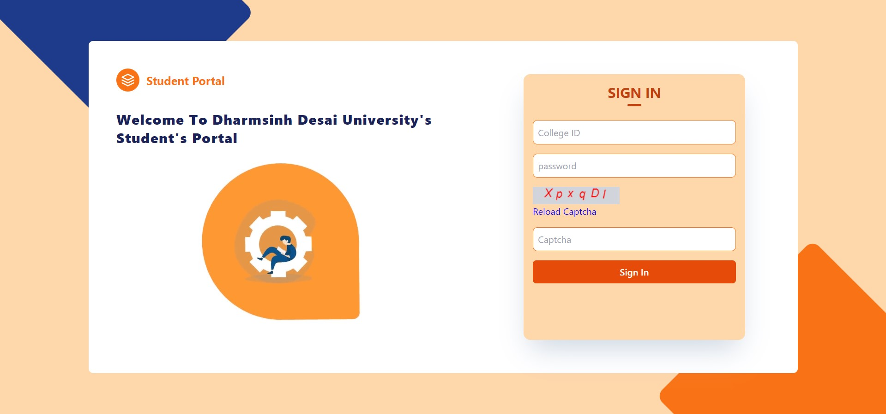
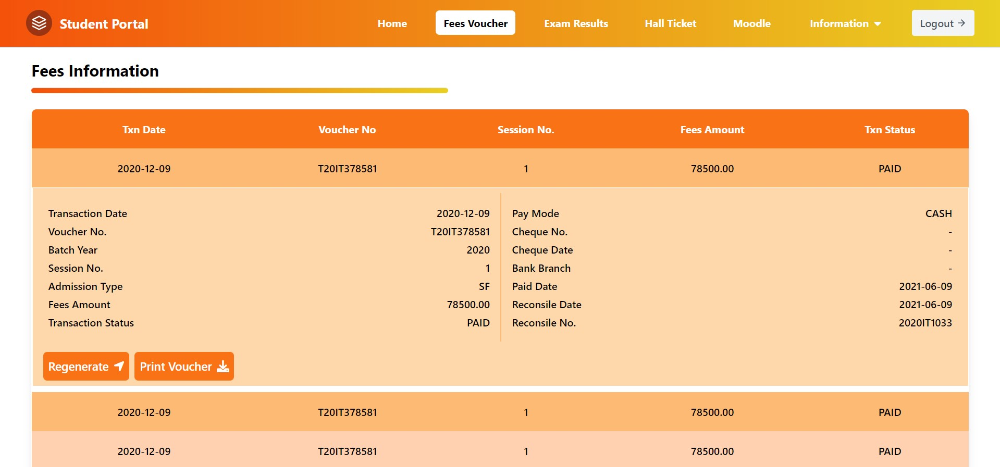

# DDU EGOV PORTAL

The intention to make this project was to make egov student portal more attractive and colourfull by using RECT App as a frontend and Tailwind as a css.

## Tech Stack

Here we use these technical components :

<p align="center">
  <a href="https://reactjs.org/">
    
  </a>
  <a href="https://tailwindcss.com/">
    
  </a>
  <a href="https://nodejs.org/">
    
  </a>
</p>

**Client:** React, TailwindCSS

**Server:** Node, Express

## Deployment

To make REACT App use this commands

```bash
  npm create-react-app Name_of_App
```

And then after you should write your code by changing directory.
for set-up Tailwind.css use this command

```bash
npm install -D tailwindcss postcss autoprefixer

npx tailwind init -p
```

After run this commands we have to change the content of 'tailwind.config.js' to this lines of code

```
 content : [
    "./src/ * * / *.{js,jsx,ts,tsx}",
    ]
```

Add these lines to "index.css"

```
@tailwind base;
@tailwind Components;
@tailwind utilities;

```

## Screenshots




